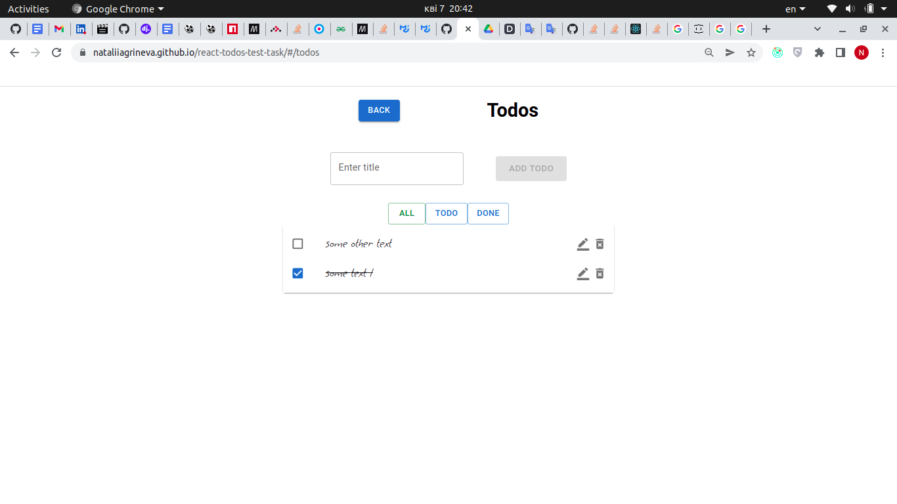
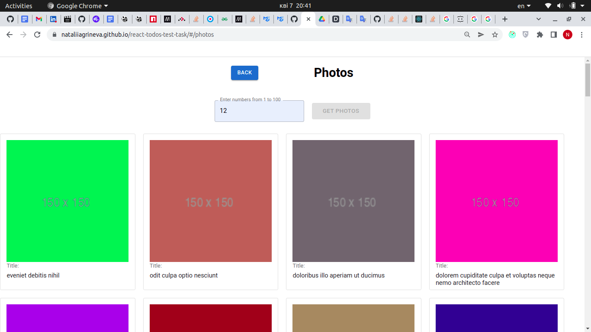
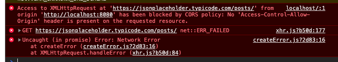

# Main Part
## 1. Home
Home page (route "/") has two buttons with links: Todos and Photos, when you click on which goes to the corresponding pages ("/todos" and "/ photos" routes);

## 2. Todos
CRUD todo
- todo can be added, deleted;
- todo's status can be switched by checkbox;
- the list remains the same when the page is reloaded (todos list is stored in the localStorage);
- when you click on todo, a page opens with the corresponding id in the route ("todos /{todo_id};

## 3. Photos
 - page (route "/photos");
 - you can enter a number from 1 to 100 in the input and click on the "Get Photos" button to get a photo of the corresponding album;
 
# Additional
 -  the todo can be edited;
 -  the todos list can be filtered by: All, Todo, Done;
 -  if the same album_id is entered in the input as the one loaded, the "Get photos" button will be disabled (not active);
 -  clicking on each image opens a modal with a high resolution image;
 -  app deployed to gh-pages;
 [demo link](https://nataliiagrineva.github.io/react-todos-test-task/)
# Technologies
 - react;
 - redux, redux-thunk;
 - react-router v6;
 - axios;
 - mui;
 - eslint, prettier;

 # Problems
 - jsonplaceholder.typicode.com not working properly on gh-pages via CORS error, works on localhost (not always online);
 
